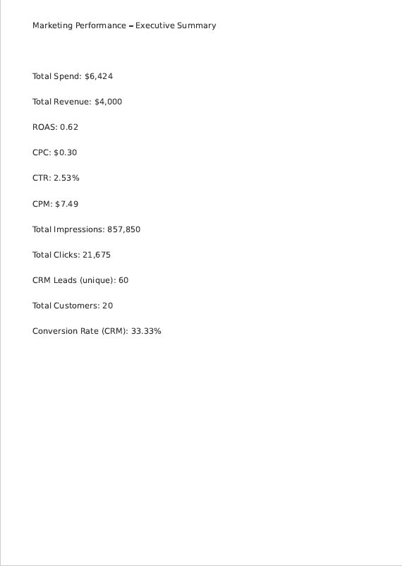
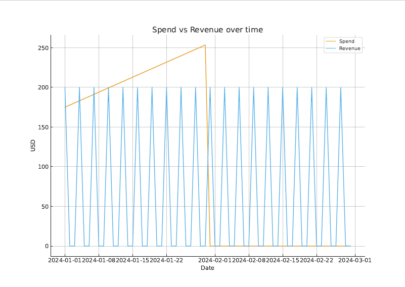
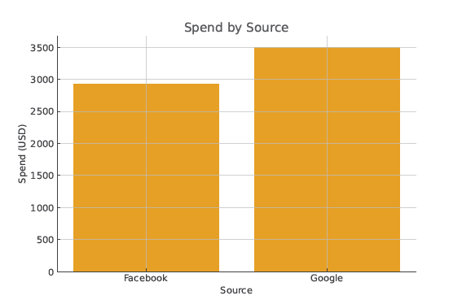
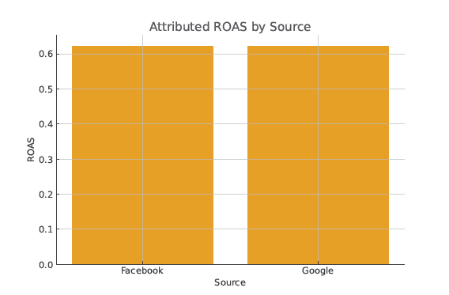
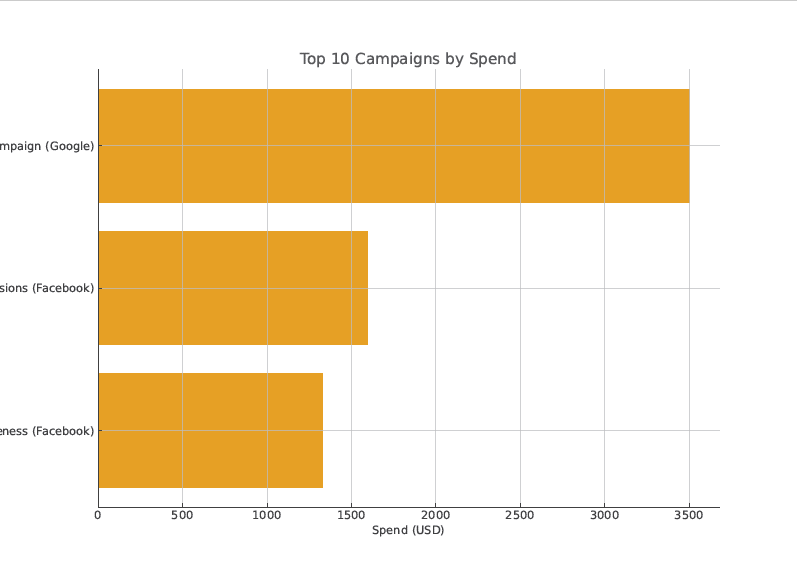

# Marketing Performance Analytics Dashboard (Portfolio)

## Overview
This repository presents a **marketing performance analytics dashboard** built as a **portfolio project**.  
The dashboard focuses on tracking key marketing KPIs such as **ROAS, CTR, CPC, Conversion Rate, and revenue trends**.

The project demonstrates practical analytics skills in **dashboard design, KPI definition, and business-oriented performance reporting** using structured and transparent analytics workflows.

---

## Project Goal
Marketing teams often need a clear and reliable way to:
- Understand which marketing channels perform best
- See how advertising spend translates into measurable outcomes
- Monitor performance trends over time

This project consolidates key performance metrics into a **single analytics dashboard** to support data-driven evaluation and reporting.

---

## Analytics Workflow Overview
The project follows a realistic analytics workflow commonly used in business environments:

- Synthetic marketing data is prepared and structured
- Key KPIs (ROAS, CTR, CPC, Conversion Rate) are calculated
- KPI summaries are validated in Excel
- Insights are visualized using a dashboard
- Outputs are shared as PDF, Excel, and web-based previews

This reflects a **practical analytics reporting workflow**, not a research or experimental setup.

---

## Dashboard Screenshots

### Executive Summary


### Channel Comparison (Facebook vs Google Ads)


### KPI Trends


### Top Campaigns by Spend


### KPI Detail Table


---

## Dashboard Features
- Executive-level performance overview  
- ROAS, CTR, CPC, Conversion Rate metrics  
- Channel-level comparison (Facebook vs Google Ads)  
- Campaign spend analysis  
- KPI trend monitoring over time  

---

## Files in This Repository
- `Marketing_Dashboard_Quick.pdf` – Static dashboard overview  
- `marketing_dashboard_summary.xlsx` – KPI summary tables  
- `index.html` – Web-based demo preview  
- `assets/` – Dashboard screenshots  
- `src/` – Supporting Python scripts for data preparation and KPI summaries  
- `requirements.txt` – Python dependencies  

---

## Data Source & Privacy
**Note:**  
This project uses **fully synthetic/demo marketing data** created solely for portfolio purposes.  
No real client, personal, or confidential data is included.

---

## Tools & Technologies
- Dashboarding & Visualization (Power BI-style reporting)
- Excel & KPI tables
- Python (basic data preparation and KPI summaries)
- Marketing analytics KPIs (ROAS, CTR, CPC, Conversion Rate)

---

## How to View
- Open `Marketing_Dashboard_Quick.pdf` for a static overview  
- Review `marketing_dashboard_summary.xlsx` to inspect KPI tables  
- Open `index.html` for a web-based demo preview  

---

## How to Reproduce
1. Clone this repository  
2. (Optional) Create a Python virtual environment  
3. Install dependencies:
   ```bash
   pip install -r requirements.txt
