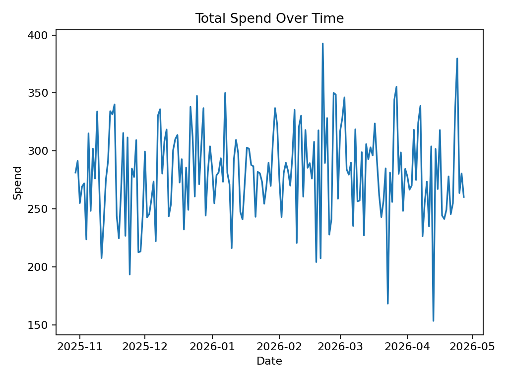
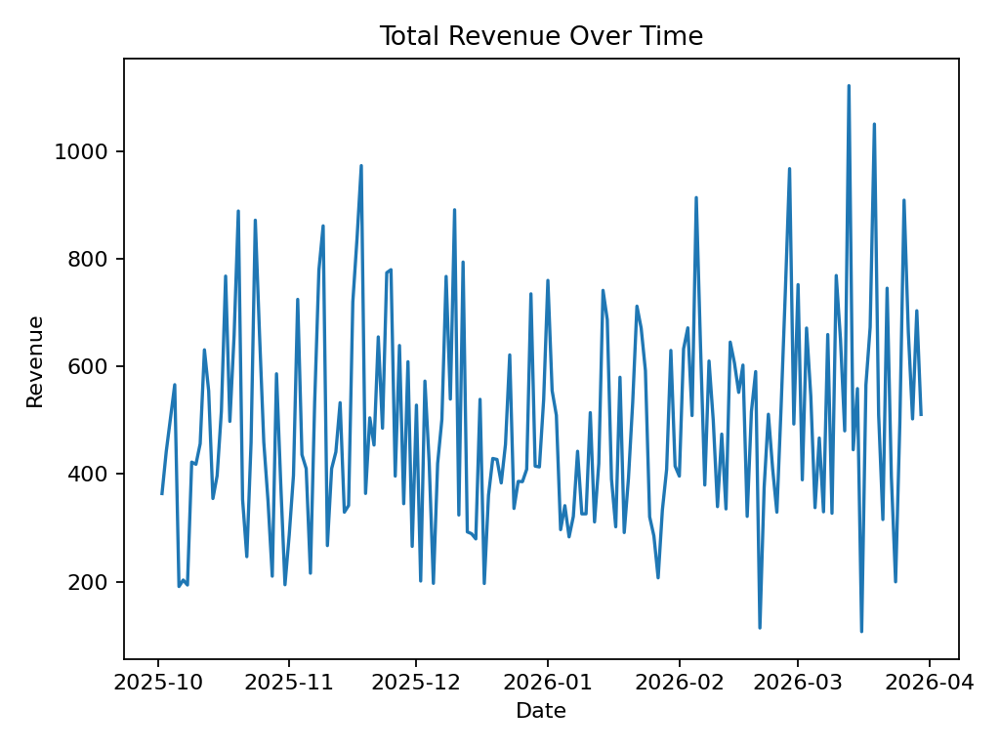

# Automated Marketing Performance Data Pipeline

## Overview
This project presents a **fully automated marketing analytics data pipeline** designed to track campaign performance, compute key business KPIs, and generate visual reports.

The entire workflow is automated using **GitHub Actions**, demonstrating real-world data engineering, analytics automation, and CI/CD best practices.

---

## Problem
Marketing teams frequently face challenges such as:
- Identifying which channels generate the highest value
- Understanding how advertising spend translates into revenue
- Tracking performance trends consistently over time

Traditional manual reporting processes are time-consuming, error-prone, and difficult to scale.

---

## Solution
This project automates the **end-to-end marketing analytics lifecycle**:

1. Generate raw marketing funnel data  
2. Transform raw data into clean, structured KPI tables  
3. Produce visual performance reports  
4. Automatically commit outputs using CI/CD automation  

All steps run **on demand or on a scheduled basis** via GitHub Actions, ensuring reproducibility and reliability.

---

## Automated Workflow (CI/CD)
The pipeline is executed using **GitHub Actions**, enabling hands-free analytics automation.

### Workflow Capabilities
- Manual trigger support (`workflow_dispatch`)
- Scheduled weekly execution
- Automatic version-controlled commits of generated outputs

### Pipeline Steps
- `fetch_data.py` → Generates raw marketing funnel data  
- `transform.py` → Computes KPIs such as CTR, Conversion Rate, and ROAS  
- `make_charts.py` → Creates charts and visual performance reports  

---

## Output Artifacts
Each pipeline execution produces the following artifacts:

- **Raw datasets** stored in `data/raw/`  
- **Processed KPI tables** stored in `data/processed/`  
- **Visual reports** stored in `reports/`  

All outputs are **automatically committed** back to the repository by the workflow, ensuring full traceability.

---

## Sample Visual Outputs
*(Generated automatically by the pipeline)*

> Additional charts added to the `reports/` directory will automatically appear after each pipeline run.

---

## Why This Matters
This project demonstrates applied skills in:

- Data engineering and analytics fundamentals  
- CI/CD-driven automation for analytics workflows  
- Reproducible and scalable data pipeline design  
- Business-focused KPI measurement and reporting  

Such systems are widely used in modern organizations to support marketing optimization and strategic decision-making.

---

## National Importance Context (EB-NIW)
Automated analytics pipelines like this reduce manual reporting effort, improve decision-making speed, and enable **data-driven resource allocation at scale**.

These capabilities support productivity growth, operational efficiency, and economic competitiveness for small and mid-sized businesses—aligning with broader U.S. national interest objectives.

---

## Tech Stack
- Python (Pandas, Matplotlib)  
- GitHub Actions (CI/CD)  
- Automated data pipelines  
- Marketing analytics KPIs  

---

## How to Run
The pipeline can be executed in two ways:

1. **Manually** via GitHub Actions → *Run workflow*  
2. **Automatically** via scheduled weekly execution  

No local setup is required.

---

## Project Status
- ✅ Fully automated analytics pipeline  
- ✅ CI/CD workflow verified and operational  
- ✅ Data and reports generated automatically  
- ✅ EB-NIW–ready project structure  
